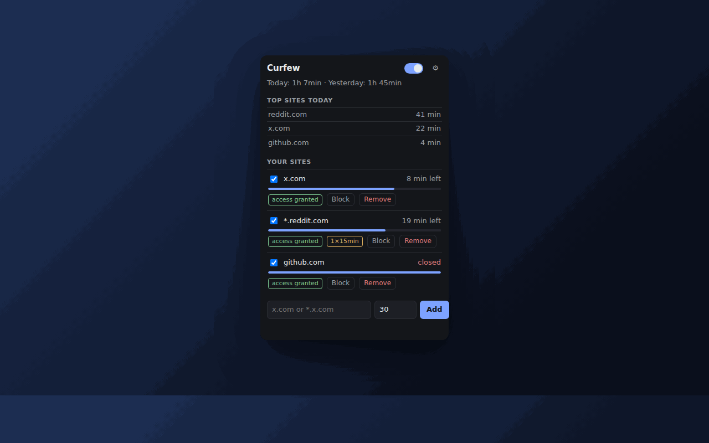
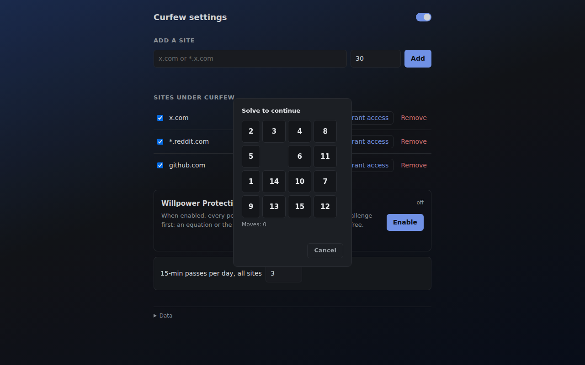
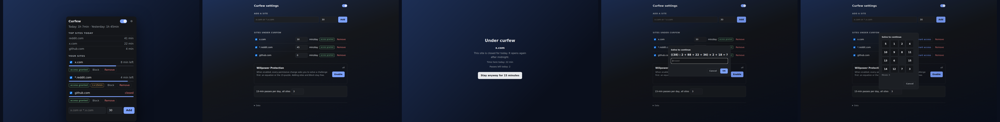
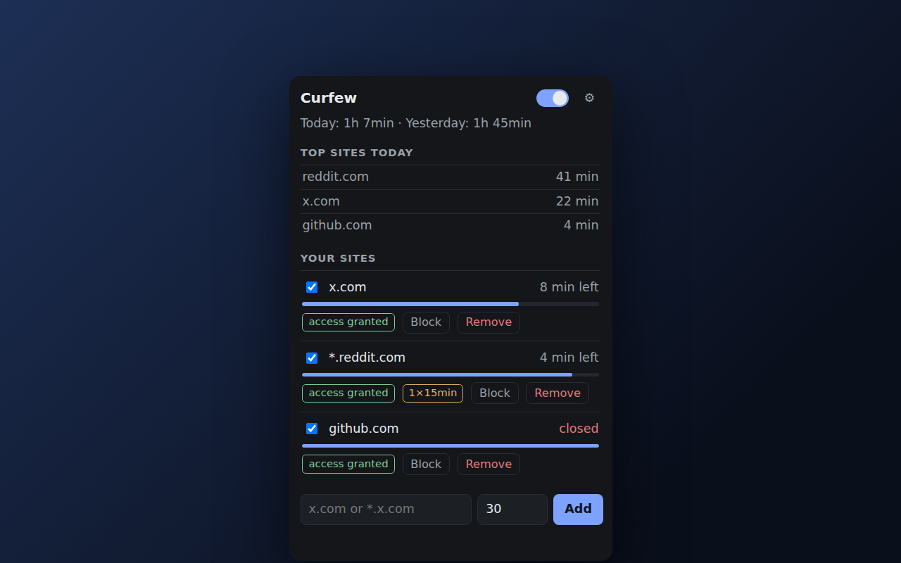
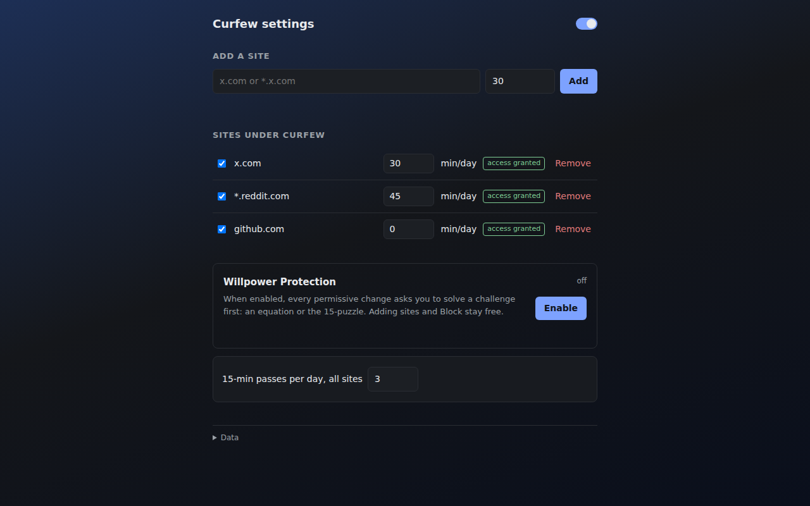
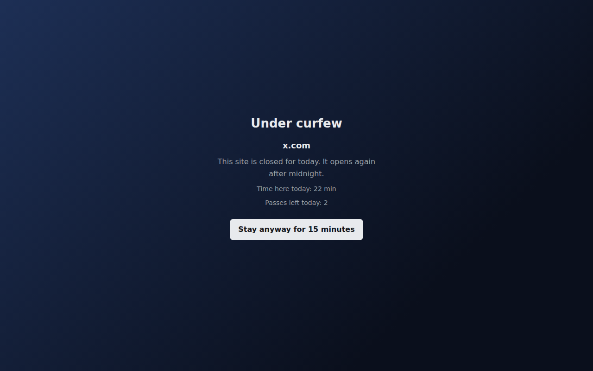
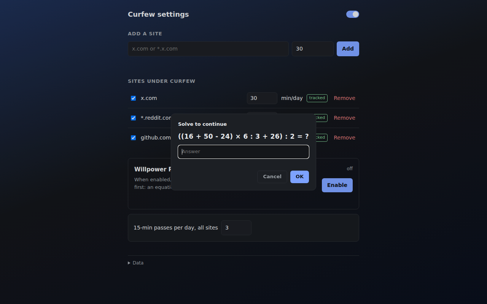

<div align="center">


# Curfew

**The internet curfew for your distraction sites.**

Daily time budgets for the sites you choose, enforced at the network level.
Local-only. Zero tracking. Zero install warnings.





[](https://github.com/devacc8/curfew-extension/actions/workflows/ci.yml)
[](LICENSE)


[Install](#install) · [How it works](#how-it-works) · [Willpower Protection](#willpower-protection) · [Privacy](#privacy) · [Development](#development)

</div>

---

## Why

"Block the whole site" tools are too blunt: YouTube is needed for study,
X for work. The problem is the *infinite scroll*, not the site. Screen-time
dashboards show you wasted 3 hours but don't stop you.

Curfew combines both: **visibility** (what actually took time) and
**enforcement** (a hard wall after the budget is spent), for the sites
YOU choose, with budgets YOU set. A curfew doesn't say "never". It says
*"not now"*. The site comes back tomorrow.

## Features

- **Daily budgets per site** — `x.com` exactly or `*.reddit.com` with
  subdomains; minutes per day, reset at local midnight
- **The wall** — when the budget is spent, the site is redirected at the
  network-request level: no flash of content, works even while the
  extension sleeps
- **Stay anyway, honestly** — 15-minute passes exist on purpose, and every
  one of them is counted and shown in the dashboard
- **Willpower Protection** — optional mode where relaxing the rules asks
  you to solve a challenge first: an equation or the 15-puzzle. The
  friction IS the lock
- **Active time only** — idle (60 s), unfocused windows and accidental
  hops don't count
- **Local only** — no accounts, no sync, no analytics, no external calls.
  Uninstalling deletes everything



### The full tour







## How it works

1. **Add a site** — right-click any page → *"Add this site to Curfew"*, or
   type a domain. Chrome asks for access to that site, and only that site
2. **Set a budget** — e.g. 30 min/day. Time counts only while you are
   actually looking at the site
3. **Hit zero** — a request-level rule intercepts the site and shows the
   wall: time spent today, passes left
4. **Stay anyway?** — 15-minute passes, counted honestly in the dashboard.
   Or wait: the wall comes down by itself at midnight

At install the browser shows **zero warnings**: the extension gets access
only to the sites you add, one prompt per site, revocable at any time.

## Willpower Protection

Optional mode for the hard days. When enabled, every permissive change (staying on a closed site,
disabling a budget, removing a site, importing) asks you to **solve a
challenge** first:

- **Equation** — something like `(79) × 7 + 77 + 61 + 65 = ?`: 5–7 terms,
  brackets, two-digit numbers, a fresh one every attempt
- **15-puzzle** — the classic sliding game, always solvable

You can't open a closed site on a whim anymore. You'll have to *decide* to.
Adding sites and blocking stay free.

## Privacy

- No data leaves the browser. No accounts, no sync, no analytics, no error
  reporting, no remote code
- Everything lives in `chrome.storage.local`; the only bytes out are a
  manual export file you create
- The full permission surface is visible per-site and revocable in
  `chrome://extensions`
- Uninstalling deletes everything. There is no external copy

## Install

**From source** (Chrome 121+):

```bash
git clone https://github.com/devacc8/curfew-extension.git
cd curfew-extension
npm ci
```

Then: `chrome://extensions` → Developer mode → **Load unpacked** →
select the `curfew-extension` folder.

> Chrome Web Store version: coming soon.

## Development

```bash
npm test          # eslint + unit tests (node --test)
npm run smoke     # E2E: real Chrome clicks through the protection flows
npm run capture   # regenerate store screenshots + README demo gif
npm run gen:icons # regenerate icons
```

The nontrivial logic (time math, pattern grammar, budget decisions, puzzle
and equation generators) lives in pure modules under `src/common/` and is
fully unit-tested; security invariants (permission allowlist, no network
calls, web-accessible surface) are enforced by tests as well.

Deep design documents:

- [Technical design](docs/TECHNICAL_DESIGN.md) — architecture, algorithms,
  decision log
- [Project doc](docs/PROJECT.md) — product spec, milestones, roadmap

## License

[MIT](LICENSE)
